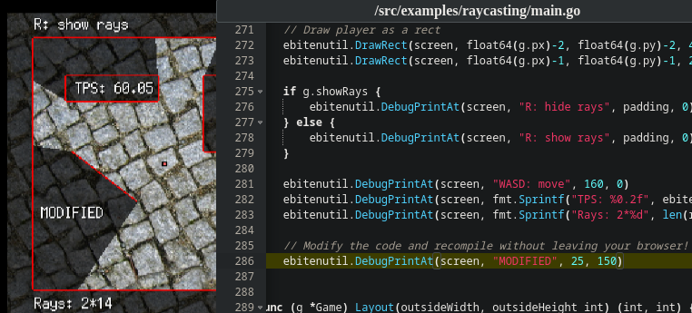

# Static Go Playground

## Features

- Full Go Compiler running on the browser: no load for the server & can be deployed easily.
    - Supports using custom build tags.
    - Incremental builds (build cache).
    - Supports multiple files and packages (including dependencies).
    - Full cross-compiling support directly from your browser.
- Full filesystem abstraction for both the compiler and running programs.
    - A standalone wasm_exec.js with filesystem support is available.
- Full DOM access for running programs (and basic stdout/stderr for now).
- Browser-based code editor ([Ace](https://ace.c9.io/)).

## [Try it out!](https://Yeicor.github.io/static-go-playground/)

Compiling and running examples from [Ebiten](https://ebiten.org):

Compiling and running modified examples:

### Use this to provide editable demos for your projects!

You just need to upload a zip of the sources for your project after running `go mod vendor` (maybe as part of your CI
process). Take a look at [setup.ts](frontend/src/go/setup.ts) for more information on automatically loading your project
on startup. For example:

<!-- TODO: Example for SDFX-UI -->

## Go Compiler on browser

This project builds the Go Compiler to WebAssembly and provides enough abstractions, fixes and hacks for it to be able
to build executables (for any platform) from the web. It also runs the compiled code (if the target arch is js/wasm),
with the same features available.

The result is a static website that can compile and run *most* Go code (see known limitations below) from the client's
browser.

Why? To learn how the Go compiler works and to provide better (hackable) demos for most Go projects with easy
deployment.

### Standard library

There are 2 approaches to handle the standard library:

- Precompiling it while building the compiler: faster first compilation but requires a bigger (slower) initial download
  and only supports building for one OS/arch, unless another precompiled library is downloaded.
- Compiling the standard library from the browser (only the required packages): It allows to cross-compile to any
  OS/arch supported by Go at the cost of an slower initial build: compiled artifacts are cached once built for the first
  time (this happens automatically for all packages with unmodified sources).

A mix of both was applied: the precompiled standard library for js/wasm is downloaded. Cross-compiling is also possible
because the source code of the standard library is downloaded and used for any other OS/arch.

## Builds

You can download production builds from the [releases](https://github.com/Yeicor/static-go-playground/releases) or the
[github pages branch](https://github.com/Yeicor/static-go-playground/tree/gh-pages).

### Building from source

Dependencies:

- Go Compiler (Go 1.13 or later)
- `node` and `npm`/`yarn`
- Very common UNIX tools.

Just run `make`: it will output a static site to `dist/` that can be uploaded to any web server. To learn how it works,
start by looking at the [Makefile](Makefile).

To only generate the modified wasm_exec.js (already embedded if using the main app), run `make wasm_exec`.

## Known limitations

- Limitations of building on `js/wasm`:
    - No Cgo support.
- Limitations of running on `js/wasm`:
    - Limited network access (available: HTTP client, WebRTC...).
    - Limited persistent storage (not implemented but could be blocked/deleted by user).
- Dependencies must be vendored (due to limited network access).
- Slower than the native compiler, and may run out of memory for large projects.

## Related projects

Updated: 03/2022

- The official Go Playground ([link](https://go.dev/play/)): limited execution time, no DOM access, no output until the
  program finishes, [limited multi-package support](https://go.dev/play/p/BWJ4dcUqVfT).
- Better Go Playground ([link](https://goplay.tools/)): has an experimental webassembly runtime, but includes no
  filesystem abstraction and still requires a server backend to build the webassembly modules, no multi-package support.
- pdfcpu ([link](https://github.com/wcchoi/go-wasm-pdfcpu/blob/master/article.md)): Example of running a Go CLI tool on
  the web browser, inspiration for this project.
- Wasm go playground ([link](https://github.com/ccbrown/wasm-go-playground)): No standard library, no dependencies, no
  multi-file support, no cross-compilation, inspiration for this project
- Go Playground WASM ([link]()): Actually compiles [Goscript](https://github.com/oxfeeefeee/goscript) (a script language
  like Python or Lua written in Rust, with exactly the same syntax as Go's) instead of using the official Go Compiler.
